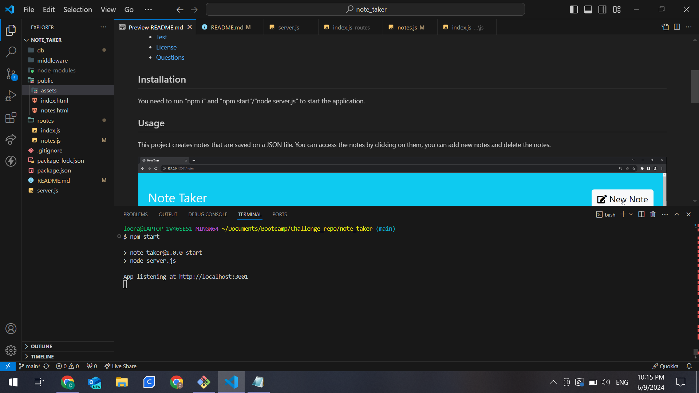

  # Note Taker  

  ## Description 
  This project was meant to work with express.js, in an application named Note Taker that can be used to write and save notes. This application will retrieve note data from JSON file. 

  ## Table of Contents 
  - [Installation](#installation)
  - [Usage](#usage)
  - [Contributing](#contributing)
  - [Questions](#questions)

  ## Installation 
  You need to run "npm i" and "npm start"/"node server.js" to start the application.

  

  ## Usage
  This project creates notes that are saved on a JSON file. You can access the notes by clicking on them, you can add new notes and delete the notes. 

  

  ## Credits
  Cristian Loera

  ## Questions
  If you have any questions about the repository, contact me in [el-bicho7](https://github.com/el-bicho7) and @ loera_73@hotmail.com
 
  